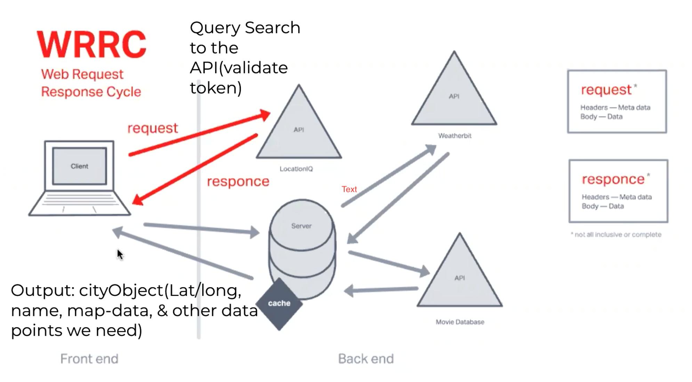
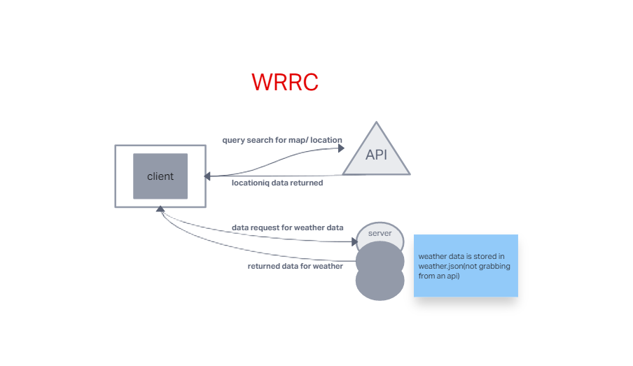
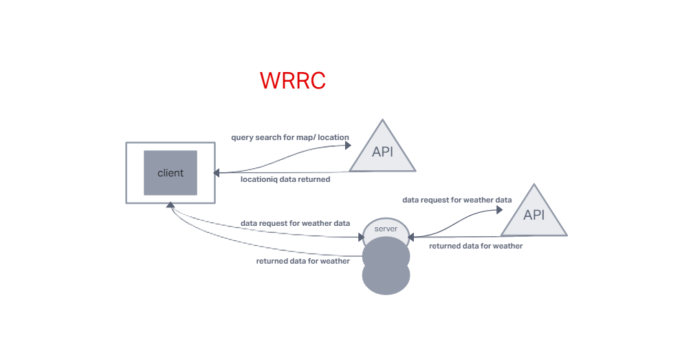
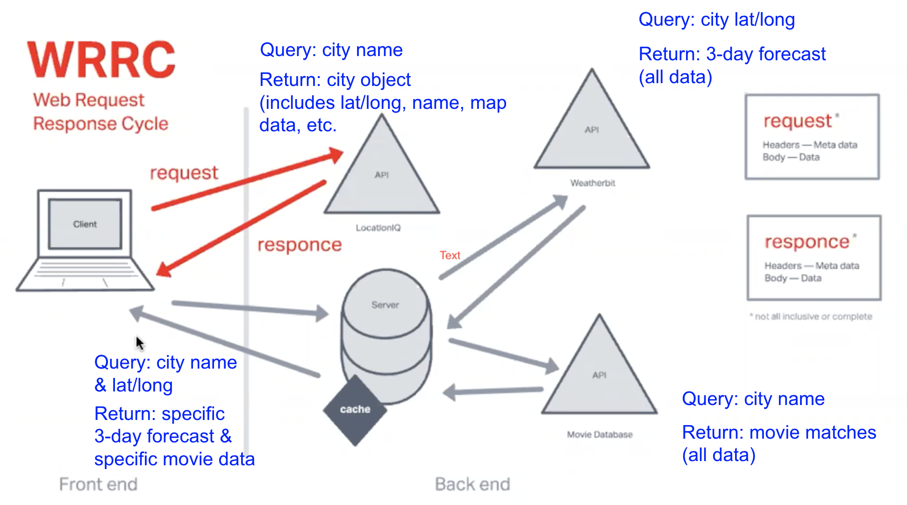

# Project Name
City Explorer

**Author**: Your Name Goes Here
**Version**: 1.0.0 (increment the patch/fix version number if you make more commits past your first submission)

## Overview
This application uses apis to locate map data and relay it to a form

## Getting Started
create a webpage integrated with react, using axios take imformation from the api and store it in states so that it can be rendered as the user inputs information they want to pull

## Architecture
<!-- Provide a detailed description of the application design. What technologies (languages, libraries, etc) you're using, and any other relevant design information. -->
the Apis are delivered through axios to our reactjavascript, using html and css the style and format is rendered onto the webpage 

## Change Log
2:05 11/17/22 lab 06 functionality is present with working latitude and longitude as well as a rendered map based off user input

## Credit and Collaborations
thank you to ricardo soto, keyan, tabor, ian shirley, and justin hammerly

Name of feature: lab 06

Estimate of time needed to complete: 5 hrs

Start time: 4:16 11-14-2022

Finish time: 2:05 11-17-22

Actual time needed to complete:3 days with

